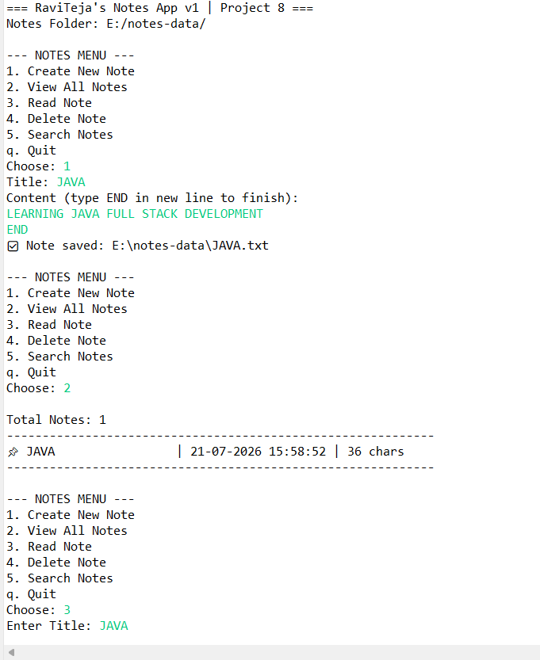
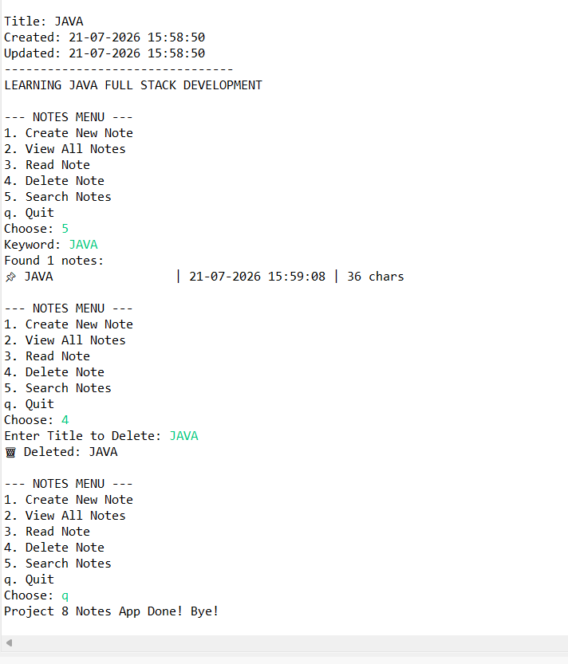

# 08 - Notes App (File-Based CRUD)

  
  
  

> **Project 8 of 100 Java Full Stack Challenge**
> A lightweight Notepad clone - Create, Read, Search & Delete notes stored as `.txt` files.

### ✨ Features
- ✅ **Create Note** - Multi-line input with `END` terminator
- ✅ **View All** - List with title, date & char count
- ✅ **Read Note** - Full content with timestamps
- ✅ **Search** - Keyword search in title + content (Streams)
- ✅ **Delete** - Safe delete with confirmation

### 🖼️ Demo

File Saved Example (`E:/notes-data/JAVA.txt`):
